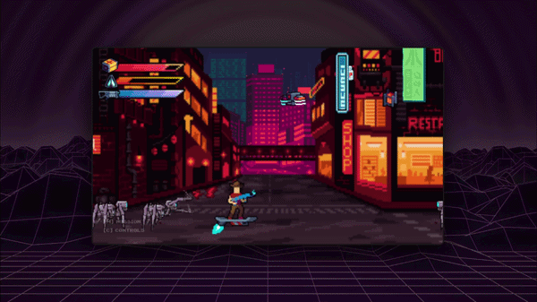

# NEON CITY 2065

A fast-paced side-scrolling action game built with Vanilla JavaScript and HTML5 Canvas.

Fight your way through a dystopian neon metropolis, defeat enemies, and survive dynamic combat scenarios in a fully custom-built game engine.

🔗 **Live Demo:** https://stefanstraeter.github.io/neon-city-2065/

---

## Preview



---

## Features

- Side-scrolling action gameplay with combat mechanics
- Object-Oriented game architecture (ES6 classes & modules)
- Multiple enemy types with individual behaviors (AI-driven)
- Collision detection and hitbox-based interactions
- Parallax scrolling and dynamic environment rendering
- Responsive canvas with mobile touch controls
- Audio system with sound effects and game feedback
- Game state system (intro, gameplay, game over)

---

## Purpose

This project was developed as part of a frontend training program at the Developer Akademie.

It demonstrates how a complete browser-based game can be built from scratch using only Vanilla JavaScript and the HTML5 Canvas API.

Focus areas include:

- object-oriented programming (OOP) and inheritance
- modular ES6 architecture without global scope pollution
- separation of concerns between rendering, logic, and systems
- building scalable and maintainable game structures

---

## Getting Started

Clone the repository:

```id="k2l9fd"
git clone https://github.com/stefanstraeter/neon-city-2065
cd neon-city-2065
```

Run the project using a local development server (e.g. VS Code Live Server).

---

## Tech Stack

- HTML5 Canvas
- Vanilla JavaScript (ES6 Modules)
- CSS3 (UI & layout)
- Web Audio API

---

## Project Structure

```id="p9x1lm"
models/
  base/
  core/
  entities/
  managers/
  environment/
```

- **models/base** – Core classes like `DrawableObject` and `MoveableObject`
- **models/core** – Game engine logic (`World`, `Camera`, `GameStateManager`)
- **models/entities** – Player, enemies, and interactive objects
- **models/managers** – Systems for audio, collisions, UI, and status handling
- **models/environment** – Backgrounds, parallax layers, and collectibles

---

## Architecture Highlights

- **Modular ES6 System**
  Clean separation of logic using `import` / `export`, eliminating global scope issues.

- **Encapsulation & Dependency Control**
  Strict module boundaries with well-defined interfaces between systems.

- **Circular Dependency Handling**
  Advanced structuring to resolve dependencies between base classes and derived entities.

- **System-Based Design**
  Independent managers for collisions, audio, UI, and game state.

---

## Technical Challenges

### Game Architecture Without a Framework

Designing a maintainable game structure required clear separation between rendering, physics, and game logic.

### Collision & Interaction System

Implementing precise hit detection and interaction logic across multiple entity types.

### State Management in a Game Context

Handling transitions between intro sequences, gameplay, and end states in a predictable way.

### Responsive Canvas & Mobile Controls

Adapting gameplay and controls for different screen sizes and touch devices.

---

## Controls

- **Keyboard**
  - Arrow Keys – Move
  - Space – Attack / Shoot
  - Arrow Up – Jump
  - Enter – Continue / Start

- **Mobile**
  - Touch controls via on-screen interface

---

## Author

**Stefan Straeter**

GitHub: https://github.com/stefanstraeter/
