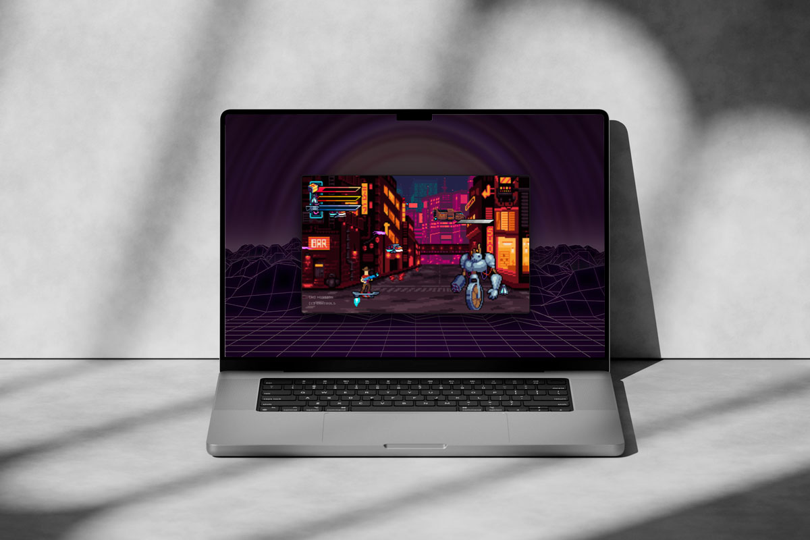

# NEON CITY 2065

## Overview

**Neon City 2065** is a high-octane action game developed as a final project during my Front-End Development training at Developer Akademie. It is a side-scrolling action game built with **Vanilla JavaScript and HTML5 Canvas**. Set in a dystopian future, players take control of "Bud" to navigate through a neon-drenched metropolis. This project serves as a deep dive into **Object-Oriented Programming (OOP)**, custom physics, and scalable game architecture.

### Preview

### Live Demo

- **Link:** [View Live Project](https://stefanstraeter.github.io/neon-city-2065/)

---

## Technical Architecture

The project follows a modular approach, separating concerns into specialized directories to ensure maintainability and scalability:

### Project Structure

- **`models/base`**: Fundamental classes (`DrawableObject`, `MoveableObject`) that provide the blueprint for inheritance.
- **`models/core`**: The engine's heart, including the `World` controller, `Camera` logic, and the central `GameStateManager`.
- **`models/entities`**: All living and interactive actors, including the protagonist "Bud", complex AI enemies (Sentry Drones, Spiders), and the Endboss.
- **`models/managers`**: High-level systems for `Audio`, `Collisions`, `UI`, and the dynamic `Status Bar`.
- **`models/environment`**: Logic for parallax backgrounds, decorative neon signs, and collectible items.

---

## Key Features & Implementation

### Advanced OOP & Inheritance

By utilizing a hierarchical class structure, common behaviors like gravity, movement, and animation frames are defined in base classes and inherited by specific entities. This strictly follows the **DRY (Don't Repeat Yourself)** principle.

### Decoupled Game Logic

- **Collision Manager**: A dedicated system that handles complex hitbox calculations and interaction triggers, separate from the rendering loop.
- **GameState Manager**: Centralized control for the game flow, managing transitions between the cinematic intro, active gameplay, and game-over states.
- **Audio Manager**: A robust solution for the Web Audio API that handles sound sprites and bypasses modern browser autoplay restrictions through user-interaction triggers.

### Responsive Cyberpunk UI

- **Adaptive Canvas**: The game utilizes a sophisticated resizing logic to maintain a consistent aspect ratio across all screen sizes.
- **Mobile-First Controls**: A custom touch-interface implementation with orientation detection (Landscape enforcement) and safe-area optimizations for modern smartphones.
- **Visual Juice**: Real-time filters, screen-shake effects, and a multi-layered parallax system create an immersive 2065 atmosphere.

---

## Getting Started

1. **Clone the repository:** `git clone https://github.com/stefanstraeter/neon-city-2065`
2. **Launch:** Open `index.html` via a local server (e.g., VS Code Live Server).
3. **Controls:** - **Keyboard:** Arrow keys to move, Space to shoot, Up to jump.
   - **System:** ENTER to progress intro, M for Mission, C for Controls.
   - **Mobile:** Use the integrated neon-touch overlay.

---

## Author

**Stefan Straeter** _Full Stack Developer_ - GitHub: [@stefanstraeter](https://github.com/stefanstraeter/)
